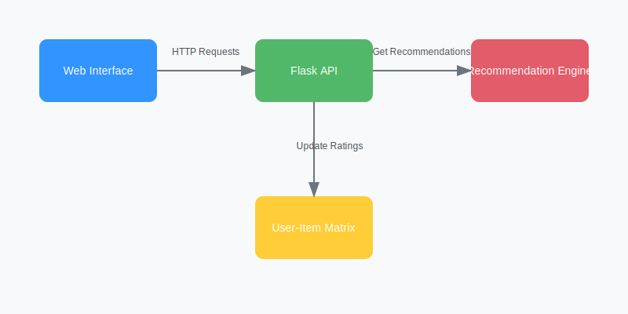

# E-commerce Recommendation System

A personalized recommendation system for e-commerce platforms using collaborative filtering and machine learning techniques. The system analyzes user behavior, preferences, and purchase history to provide tailored product recommendations.

## Features

- **Collaborative Filtering**: Uses user-based collaborative filtering to find similar users and recommend products
- **Real-time Updates**: Recommendations update instantly when new ratings are added
- **RESTful API**: Simple API for getting recommendations and recording user interactions
- **Web Interface**: Clean, modern UI for testing and demonstration
- **Scalable Architecture**: Designed to be easily extended with more advanced features

## System Architecture



The system consists of four main components:
1. **Web Interface**: User-friendly interface for testing and demonstration
2. **Flask API**: RESTful API handling requests and responses
3. **Recommendation Engine**: Core component implementing collaborative filtering
4. **User-Item Matrix**: Data structure storing user preferences and interactions

## Project Structure

```
recommendation-system/
│
├── app.py                 # Flask application with API endpoints
├── recommender.py         # Core recommendation engine
├── requirements.txt       # Project dependencies
└── templates/
    └── index.html        # Web interface
```

## Quick Start

1. **Clone the repository**
```bash
git clone [your-repo-url]
cd recommendation-system
```

2. **Install dependencies**
```bash
pip install -r requirements.txt
```

3. **Run the application**
```bash
python app.py
```

4. **Access the web interface**
- Open `http://localhost:5000` in your browser
- Try getting recommendations for users (IDs: 1-4)
- Add new ratings to see how recommendations change

## API Documentation

### Get Recommendations
```http
GET /recommendations/<user_id>
```
- Returns personalized product recommendations for the specified user
- Optional query parameter: `n` (number of recommendations, default=5)

### Record Interaction
```http
POST /record_interaction
Content-Type: application/json

{
    "user_id": 1,
    "product_id": 104,
    "rating": 5
}
```
- Records a new user-product interaction
- Rating should be between 1-5

## How It Works

1. **Collaborative Filtering Algorithm**
   - Creates a user-item matrix of ratings
   - Computes user similarities using cosine similarity
   - Recommends products based on similar users' preferences

2. **Sample Data**
   - Users: IDs 1-4
   - Products: IDs 101-103
   - Ratings: Scale of 1-5

## Contributing

We welcome contributions! Here are some ways you can help:

### Enhancement Ideas
1. **Algorithm Improvements**
   - Implement item-based collaborative filtering
   - Add content-based filtering
   - Implement hybrid recommendation approaches
   - Add support for implicit feedback

2. **Feature Additions**
   - User authentication system
   - Product categories and filtering
   - Recommendation explanations
   - A/B testing framework
   - Performance metrics and analytics

3. **Data Management**
   - Database integration (e.g., PostgreSQL, MongoDB)
   - Data preprocessing pipelines
   - Cold start problem solutions
   - Batch processing for large datasets


4. **UI/UX Improvements**
   - Enhanced product visualization
   - User preference settings
   - Admin dashboard
   - Mobile-responsive design

### Getting Started with Development
1. Fork the repository
2. Create a feature branch
3. Make your changes
4. Submit a pull request

## Technical Considerations

- Python 3.12+ required
- Uses numpy, pandas, and scikit-learn for computations
- Flask for web server
- Designed for easy extension and modification

## License

This project is released under the [MIT License](LICENSE). Please see the [LICENSE](LICENSE) file for details. If you have any questions or suggestions, please [open an issue](https://github.com/yash8107/recommendation-system/issues).

## Contact

[Your contact information]
